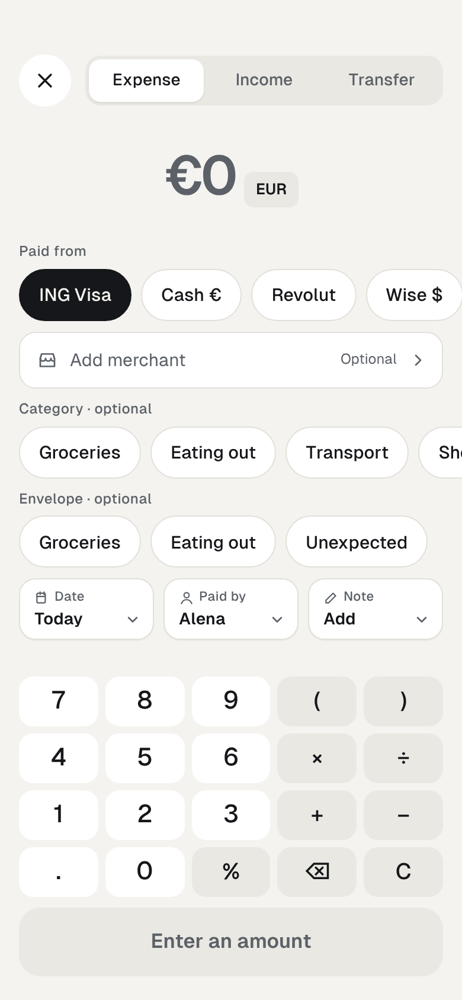

# Pattern: category and envelope on Add expense

Rules: UI-ADD-8 to UI-ADD-12, CAT-5

screens/AddExpense.html

| When | Then |
|---|---|
| Form opens | Nothing selected. |
| Merchant with a rule picked | Rule fills empty or rule-set category and envelope. Label: “Category · from REWE rule”; hint “Rule applied · change”. |
| Member picks a chip | That value is final; rules never overwrite it. Tapping it again clears it. |
| Category set, envelope empty | Envelope label previews “if empty, Groceries”; the default is filled on save. |
| Saved | Confirmation says what was filled: “Groceries envelope added from the Groceries category.” |
