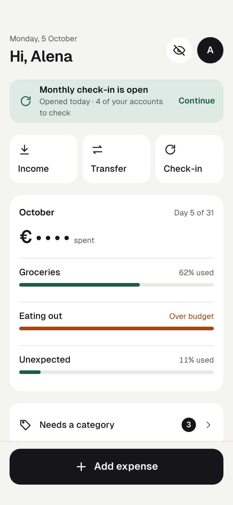

# Pattern: private Home

Rules: UI-HOME-1 to UI-HOME-6

screens/Main.html

1. Greeting, profile avatar, eye.
2. Check-in banner while one is open, without amounts.
3. Quick tiles: Income, Transfer, Check-in.
4. Envelopes this month as shares used.
5. Needs a category with its count, only when above zero.
6. Family wealth, hidden, opening the latest check-in summary.
7. Everything grid of eight destinations.
8. Sticky “Add expense”.
